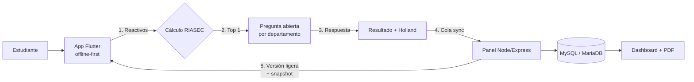

<div align="center">
  

  # App Vocacional ITTUX 1.3.2

  **Descubre tu camino** — Orientación vocacional con modelo RIASEC / Holland, operación offline-first y panel institucional en tiempo real.

  [](.)
  [](.)
  [](.)
  [](admin_panel/)
  [](admin_panel/sql/schema.sql)
  [](lib/core/database/)
  [](.)

  <p>
    <a href="#-características">Características</a> •
    <a href="#-cómo-funciona">Cómo funciona</a> •
    <a href="#-instalación">Instalación</a> •
    <a href="#-api-del-panel">API</a> •
    <a href="#-versionado">Versionado</a>
  </p>
</div>

---

## ✨ Características

| Módulo | Lo que hace |
|---|---|
| 📝 Test RIASEC | 30 reactivos offline, puntajes 0–50 por dimensión y código Holland de 3 letras |
| 🎯 Ranking de carreras | Afinidad por perfil vectorial + congruencia hexagonal Holland, top 3 con enlaces TecNM |
| 💬 Pregunta abierta | Obligatoria (mín. 10 caracteres), ligada al departamento del top 1; no modifica puntaje y no se puede saltar por URL |
| 🏫 Catálogos vivos | Versionados con atajo por versión y UPSERT rápido: sync acotado en arranque, en vivo al reanudar/cada 5 min, manual en Ajustes |
| 🗣️ Lenguas e idiomas | Clasificación por tipo relacional + sugerencias ciudadanas con aprobación administrativa |
| 📴 Offline-first | SQLite local precargado, verificación contra el backend (`/health`), colas de envío con tope de reintentos |
| 🖥️ Panel web | CRUD de catálogos, dashboard en vivo (Socket.IO), filtros, revisión de sugerencias, reportes PDF y endpoint ligero de versión |
| 🔒 Datos | UTF-8/utf8mb4 integral, bajas lógicas (`active=0`) que no rompen históricos, IDs de resultado UUID |

<div align="center">
  
  
  
  
  
  
  <br/>
  <em>Avatares incluidos + editor con galería y cámara</em>
</div>

## 🧭 Cómo funciona



1. El splash sincroniza catálogos (acotado) **antes** de navegar: los datos nuevos se ven desde la 1ª apertura.
2. El test se responde **sin internet** contra el SQLite local, con progreso reanudable.
3. Al terminar reactivos se calcula el ranking y se exige la pregunta abierta del departamento ganador.
4. El resultado (Holland, RIASEC, top 1, abierta, género, edad, escuela, lenguas) se envía o encola con reintentos acotados.
5. Con red, la app revisa la versión del panel al reanudar y cada 5 min; sin red, lo pendiente entra en el siguiente arranque.

## 🛠️ Stack

| Capa | Tecnología |
|---|---|
| App | Flutter 3, Riverpod, go_router, sqflite |
| Panel | Node.js, Express 4, EJS, Socket.IO, PDFKit |
| Datos | MySQL/MariaDB (maestro) → SQLite (copia local) |
| Auth ingesta | `Authorization: Bearer API_INGEST_KEY` |

## 📁 Estructura

```
app_vocacional/
├── lib/                  # App Flutter (app, core, features)
│   ├── core/             # BD, red, sync, constantes
│   └── features/         # test, result, profile, catalog, avatar…
├── assets/               # avatares, branding, seed SQLite, institución
├── admin_panel/          # Panel web + API (repo separado sugerido)
│   ├── src/server.js     # API + vistas
│   ├── sql/schema.sql    # Esquema MySQL maestro
│   ├── public/ views/    # UI del panel
├── database_model/       # Modelos SQLite de referencia
└── CAMBIOS.md              # Bitácora viva (arriba = revisión actual)
```

## 🚀 Instalación

<details>
<summary><strong>📱 App Flutter</strong></summary>

```bash
flutter pub get
flutter run --dart-define=APP_VOCACIONAL_API_URL=http://IP_DE_TU_PC:8080/api
```

> En producción usa exclusivamente la URL HTTPS institucional y define `APP_VOCACIONAL_API_KEY` con el mismo valor de `API_INGEST_KEY` del panel.

</details>

<details>
<summary><strong>🖥️ Panel web + API</strong></summary>

```bash
mysql -u root -p < admin_panel/sql/schema.sql
cd admin_panel
cp .env.example .env   # edita credenciales y API_INGEST_KEY
npm install
npm start
```

Panel en `http://localhost:8080` · Salud en `GET /health`. Detalle completo en [`INSTALACION_VERSION_13.md`](INSTALACION_VERSION_13.md) y [`admin_panel/README.md`](admin_panel/README.md).

</details>

## 🔌 API del panel

| Método | Ruta | Descripción | Auth |
|---|---|---|---|
| `GET` | `/health` | Estado del servicio + BD | — |
| `GET` | `/api/catalog-version` | Versión ligera del catálogo (chequeo en vivo) | API key |
| `GET` | `/api/catalogs` | Snapshot versionado de catálogos | API key |
| `POST` | `/api/catalog-suggestions` | Sugerir lengua, idioma o escuela | API key |
| `POST` | `/api/evaluations` | Registrar evaluación del test | API key |

## 🔢 Versionado

Esquema `1.3.2-10` → versión **1**, sub modificación semigrande **3**, subcambios menores **2**, revisión **10**.

Detalle de esta versión en [`CAMBIOS.md`](CAMBIOS.md) (sección superior = revisión actual).

## 🗺️ Hoja de ruta

- [x] Chequeo ligero de versión de catálogo + sync en vivo
- [ ] Generación del seed SQLite desde MySQL (`npm run export:seed`)
- [ ] Actualización del APK por Drive (endpoint `app-status` + instalador)
- [ ] Higiene del repo (sacar `node_modules` del tracking)

---

<div align="center">
  
  <br/>
  <sub>Instituto Tecnológico de Tuxtepec · App Vocacional ITTUX 1.3.2 · Uso institucional</sub>
</div>
